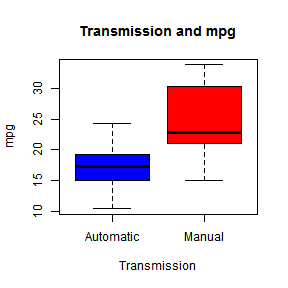
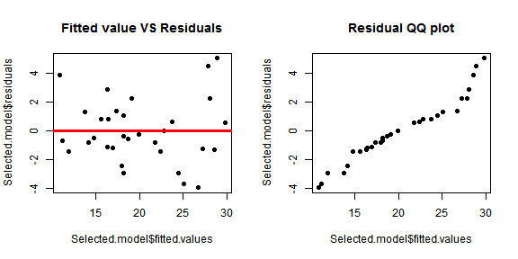
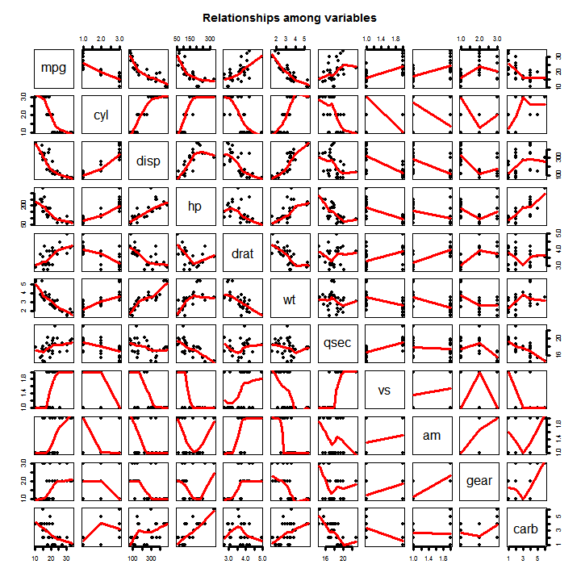

## Automatic Or Manual: Which Is Better In Terms Of MPG
### 1 Summary
In this study, I am trying to understand whether automatic or manual transmission is better for mpg. The dataset mtcars[1] used in the study was extracted from the 1974 Motor Trend US magazine.Based on a two sided t-test there is a statistical significant difference between automatic and manual transmitted cars in terms of mpg.The regression model selected using backward selection with AIC as the criteria suggests that holding other variables in the model constant, manual transmitted cars' mpg is 1.80921 more than automatic transmitted cars.
### 2 Load And Process Data

```r
data(mtcars)
```

Convert categorical variables into factors

```r
mtcars$am <- as.factor(mtcars$am)
mtcars$cyl <- as.factor(mtcars$cyl)
mtcars$gear <- as.factor(mtcars$gear)
mtcars$carb <- as.factor(mtcars$carb)
mtcars$vs <- as.factor(mtcars$vs)
```

### 3 Exploratory Data Analysis
According to figure 1(see appendix), manual cars are better than automatic cars in term of MPG. Figure 2(see appendix) suggests that variables "cyl","disp","hp" and "wt" are also highly correlated with mpg.
### 4 Inference
The two sample t-test confirmed this difference. The null hypothesis $H_0$ is:There is no difference between automatic car and manual car in terms of MPG.

```r
TTest <- t.test(x = mtcars[mtcars$am == 0, ]$mpg, y = mtcars[mtcars$am == 1, 
    ]$mpg, paired = FALSE)
TTest$p.value
```

```
## [1] 0.001374
```

Based on this p value and using 0.05 as the criteria, the null hypothesis should be rejected, suggests a statistical significant difference between automatic car and manual car in terms of MPG.  
### 5 Model Selection
Backward selection method with AIC as criteria is usd to choose a regression model. 

```r
model <- lm(mpg ~ ., data = mtcars)
Selected.model <- step(model, direction = "backward", k = 2)
```

Table 1(see appendix) is the summary table of the selected model. According to it, the adjusted r-squared is 0.8659, suggest that 86% of the variation in mpg is explained by the selected model.    
The coefficient of "am" in the selected model 1.80921 interpreted as: holding "wt", "cyl" and "hp" constant, manual transmitted cars' mpg is 1.80921 more than automatic transmitted cars.
### 6 Model Comparision
Comparing the selected model with models contain only a subset of variables of it using Analysis of Variance(ANOVA).

```r
Null.model <- lm(mpg ~ am, data = mtcars)
model1 <- lm(mpg ~ am + cyl, data = mtcars)
model2 <- lm(mpg ~ am + cyl + hp, data = mtcars)
anova(Null.model, model1, model2, Selected.model)[2:4, 6]
```

```
## [1] 1.388e-08 2.164e-03 9.081e-03
```

The analysis suggests that selected model is statistical significantly different from all the other models and variables "cyl","hp" and "wt" do contribute to the variation of mpg in the dataset.   
### 7 Residual Analysis 
Figure 3(see appendix), a plot of fitted values of the selected model vs the residuals, suggests that the residuals are independently distributed.Figure 4(see appendix), a residual QQ plots, suggests that the residuals are normally distributed.
### 8 Diagnositics
The leverages for the dataset is calculated and based on a criteria 0.5 there are no outlier.

```r
leverage <- hatvalues(Selected.model)
sum(leverage > 0.5)
```

```
## [1] 0
```

    
    
## Appendix
### Figure 1

```r
boxplot(mtcars$mpg ~ mtcars$am, col = c("blue", "red"), xlab = "Transmission", 
    ylab = "mpg", main = "Transmission and mpg", names = c("Automatic", "Manual"))
```

 

### Figure 3 and Figure 4

```r
par(mfrow = c(1, 2))
plot(Selected.model$fitted.values, Selected.model$residuals, pch = 19, main = "Fitted value VS Residuals")
abline(0, 0, col = "Red", lwd = 3)
qqplot(Selected.model$fitted.values, Selected.model$residuals, pch = 19, main = "Residual QQ plot")
```

 

### Figure 2

```r
plot(mtcars, panel = panel.smooth, pch = 19, lwd = 3, main = "Relationships among variables")
```

 

### Table 1

```r
summary(Selected.model)
```

```
## 
## Call:
## lm(formula = mpg ~ cyl + hp + wt + am, data = mtcars)
## 
## Residuals:
##    Min     1Q Median     3Q    Max 
## -3.939 -1.256 -0.401  1.125  5.051 
## 
## Coefficients:
##             Estimate Std. Error t value Pr(>|t|)    
## (Intercept)  33.7083     2.6049   12.94  7.7e-13 ***
## cyl6         -3.0313     1.4073   -2.15   0.0407 *  
## cyl8         -2.1637     2.2843   -0.95   0.3523    
## hp           -0.0321     0.0137   -2.35   0.0269 *  
## wt           -2.4968     0.8856   -2.82   0.0091 ** 
## am1           1.8092     1.3963    1.30   0.2065    
## ---
## Signif. codes:  0 '***' 0.001 '**' 0.01 '*' 0.05 '.' 0.1 ' ' 1
## 
## Residual standard error: 2.41 on 26 degrees of freedom
## Multiple R-squared:  0.866,	Adjusted R-squared:  0.84 
## F-statistic: 33.6 on 5 and 26 DF,  p-value: 1.51e-10
```

